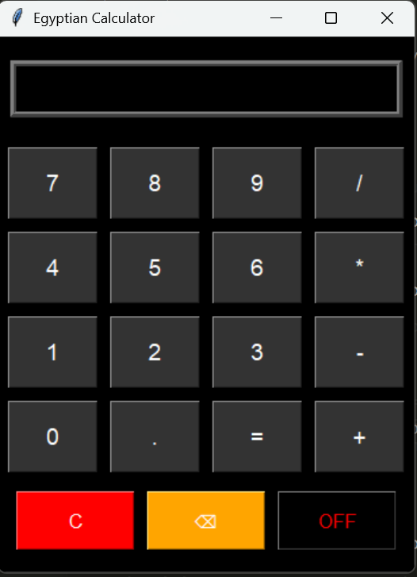

# Egyptian Calculator 🧮🇪🇬

This is a simple desktop calculator application built with **Python** and **Tkinter**.

It performs basic arithmetic operations like addition, subtraction, multiplication, and division.  
The design is customized with colored buttons for better visual experience.

---

## 📸 Screenshot



---

## 🚀 Features

- Simple and clean UI
- Supports +, -, *, /
- Dark mode styled interface
- Buttons: C (clear), ⌫ (backspace), OFF (exit)

---

## 🛠️ Technologies

- Python 3
- Tkinter
- PyInstaller (to create the `.exe`)
- Inno Setup (to build the installer)

---

## 📦 Installation

Download the latest release from the [Releases](https://github.com/hafiz6917/Disck-calculator/releases) section:  
➡️ `calculator_setup.exe`

---

## 🔧 How to Run from Source

```bash
python main.py

Project Structure
Disck-calculator/
│
├── main.py
├── README.md
├── calculator_installer.iss
├── dist/
│   └── calculator.exe
├── screenshots/
│   └── calculator_ui.png
└── ...

📄 License
This project is licensed under the MIT License.

